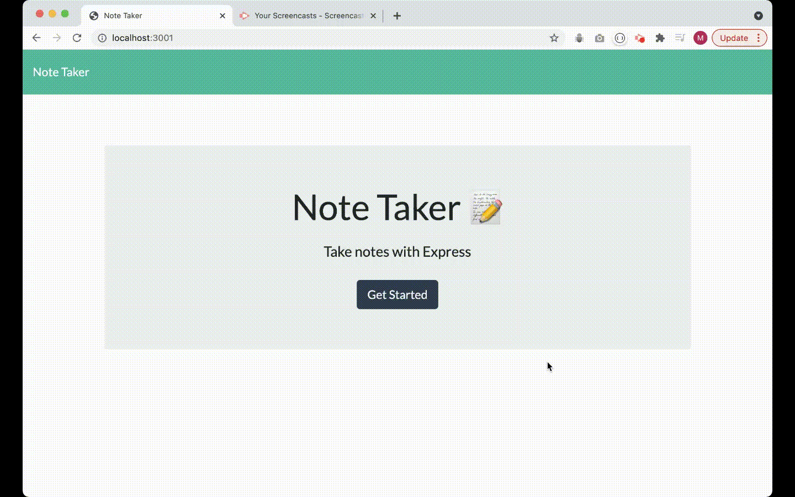

# Note-Taker


## Description

In this project, my task is to modify starter code to create an application called Note Taker that can be used to write and save notes.

## URL Link to GitHub Repository

https://github.com/jingwang6028/Note-Taker

## URL Link to Heroku deployed page

https://express02heroku.herokuapp.com/

## Mock-Up Image

A walkthrough gif demonstrating the functionality of the application.


## Table of Contents

- [Requirements](#Requirements)
- [Installation](#installation)
- [License](#license)
- [Questions](#questions)

## Requirements

```
Node.js
npm
```

## Installation

To install necessary dependencies, run the following command:

```
npm i
```

## License

This project is licensed under the MIT license.

## Questions

If you have any questions about the repo, open an issue or contact me directly at jingwang6028@gmail.com. You can find more of my work at [jingwang6028](https://github.com/jingwang6028).
